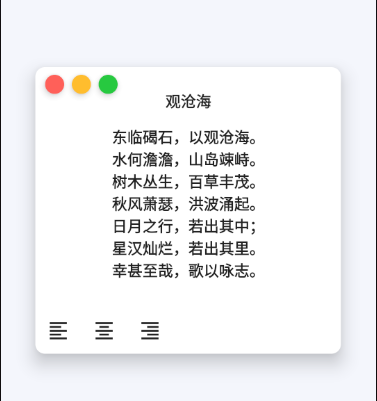
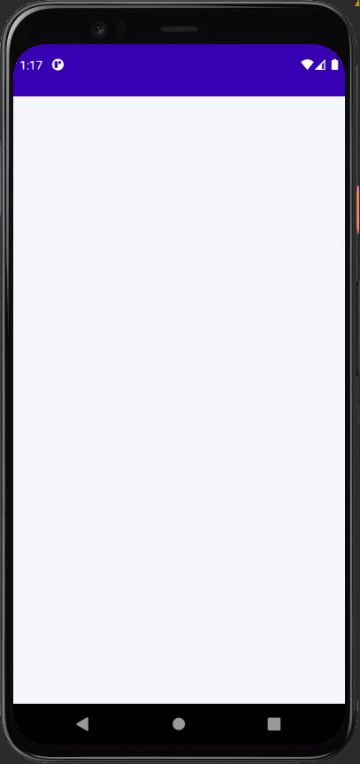
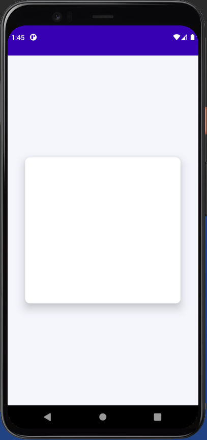

summary: 备份
id: 诗句卡片
categories: Android
tags: android
status: Published
authors: Nthily
Feedback Link: https://github.com/Nthily

# 诗句卡片

## 概述
Duration: 1

### 本节的 Codelabs 我可以学到什么？

- **这节 Codelabs 你将会学到如何制作出以下这个界面**
- **学习简单的状态管理**




## 定位布局
Duration: 2.5

#### 在这个步骤中，你将会创建一个可以定位在屏幕中央的布局

### **步骤一：添加布局**


1. 使用 `Box` 创建一个布局
2. 添加 `Box` 中的参数 `modifier` 和 `contentAlignment` 参数

```kotlin
Box(
    modifier = Modifier
        .fillMaxSize()
        .background(Color(0xFFF4F6FC)), // 为了和白色进行区分
    contentAlignment = Alignment.Center 
    // 将 Box 中的内容定位相对于父布局（也就是 Box 自己）的中间
){
    // 内容
}
```

#### 到这里，我们已经创建了一个 `Box` 布局，它将占满整个父布局的空间，并且设置了一个背景颜色

 

positive
: 虽然现在看上去不像是有居中的样子，但是只要我们在 `Box` 里面添加一些内容，它将会在中心显示

## 创建内容布局

#### 在这一步骤中，你将会创建一个内容布局用来显示诗词、按钮等

### **步骤一：添加内容布局**

1. 使用 `Surface` 来为内容进行填充
2. 添加 `Surface` 中的参数，来进行具体设置

``` kotlin
Box(
    modifier = Modifier
        .fillMaxSize()
        .background(Color(0xFFF4F6FC)),
    contentAlignment = Alignment.Center
){

    Surface(
        elevation = 14.dp,
        color = Color.White,
        shape = RoundedCornerShape(10.dp),
        modifier = Modifier
            .width(320.dp)
            .height(300.dp)
    ){
        // 内容
    }
}
```

#### **如果一切正常的话，程序将会运行至如下的效果：**

 